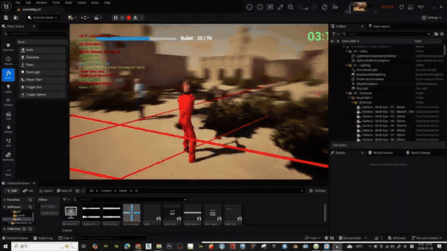

# ShtGameDEV — Unreal Engine Shooter Prototype

## Gameplay Video / 게임플레이 영상

**▶ [Watch the full video on YouTube / 유튜브에서 전체 영상 보기](https://www.youtube.com/watch?v=3SFNkZAEDhU)**

## English

ShtGameDEV is a third-person shooter prototype developed in Unreal Engine with a combination of C++ gameplay systems and Blueprint content. The project explores character combat, weapons, enemy AI, pickups, UI feedback, visual effects, and environment optimization.

### Implemented Systems

- Player and enemy character classes
- Pistol and rifle weapon types
- Projectile and line-trace shooting
- Ammunition and weapon-count UI
- Reusable health component and health-bar binding
- Enemy health bars displayed above characters
- Health-restoration pickups with sound and visual effects
- Niagara impact effects and shooting feedback
- Enemy AI using Blackboard and Behavior Tree logic
- Enemy aiming and player-attack behavior
- HUD, player state, game state, and custom game mode
- Nanite-enabled environment assets

### Tech Stack

- Unreal Engine
- C++
- Blueprints
- Behavior Trees and Blackboards
- Niagara VFX
- Git LFS for Unreal binary assets

### Project Structure

- `Source/SelfGame`: C++ gameplay framework
- `Content`: Blueprints, maps, animation, UI, effects, and game assets
- `Config`: Unreal Engine project configuration

> This is a learning and prototyping project. Large Unreal binary assets are managed with Git LFS where applicable.

---

## 한국어

ShtGameDEV는 Unreal Engine에서 C++ 게임플레이 시스템과 Blueprint 콘텐츠를 함께 사용하여 제작한 3인칭 슈팅 게임 프로토타입입니다. 캐릭터 전투, 무기, 적 AI, 아이템, UI 피드백, 시각효과와 환경 최적화를 실험하는 프로젝트입니다.

### 구현된 시스템

- 플레이어 및 적 캐릭터 클래스
- 권총과 소총 무기 종류
- 발사체 및 Line Trace 기반 사격
- 탄약과 보유 무기 개수 UI
- 재사용 가능한 체력 컴포넌트와 체력바 바인딩
- 적 캐릭터 머리 위 체력바 표시
- 사운드와 VFX가 적용된 체력 회복 아이템
- Niagara 피격 효과와 사격 피드백
- Blackboard와 Behavior Tree 기반 적 AI
- 적 조준 모션과 플레이어 공격 행동
- HUD, Player State, Game State 및 사용자 게임 모드
- Nanite가 적용된 환경 에셋

### 기술 구성

- Unreal Engine
- C++
- Blueprints
- Behavior Tree 및 Blackboard
- Niagara VFX
- Unreal 바이너리 에셋 관리를 위한 Git LFS

### 프로젝트 구조

- `Source/SelfGame`: C++ 게임플레이 프레임워크
- `Content`: Blueprint, 맵, 애니메이션, UI, 효과 및 게임 에셋
- `Config`: Unreal Engine 프로젝트 설정

> 학습과 기능 검증을 위한 프로토타입 프로젝트이며, 대용량 Unreal 바이너리 에셋은 필요한 경우 Git LFS로 관리합니다.
